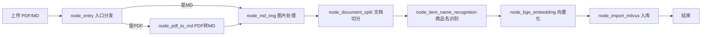
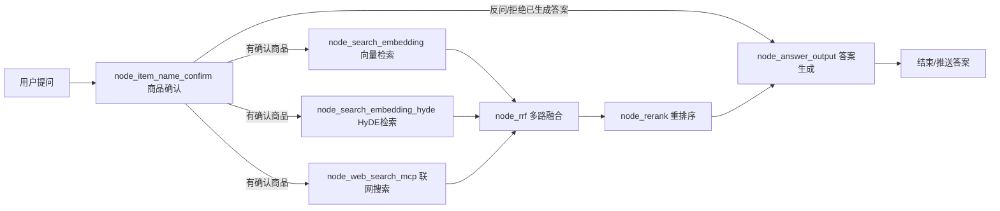

# 知识管家（knowledge_hub）详细设计文档

> 适用对象：完全不懂代码的小白、新加入项目的同学、想快速理解系统设计的人。
> 阅读建议：先看第 1、2、3 章建立整体印象，再按需细读第 7、8 章节点详解。

---

## 1. 这个项目是做什么的？

这是一个 **企业知识库问答系统**，名字叫“知识管家”。它解决两个核心问题：

1. **把资料“喂”进系统**（导入流程）：把 PDF、Markdown 等文档解析、切分、向量化，存进向量数据库，相当于给资料做“索引卡片”。
2. **让用户“问”出答案**（查询流程）：用户用自然语言提问，系统从知识库里检索最相关的资料片段，交给大模型（LLM）生成回答，还可以联网搜索补充。

一句话：**先建索引，再问答**。

举例：
- 你上传一份《HAK180 烫金机说明书.pdf》，系统自动解析并入库；
- 你问“180 烫金机怎么调温度？”，系统从说明书里找到相关段落，生成回答；
- 你上传一份《Vibe Coding 简介.md》，问“什么是 Vibe Coding？”，系统也能从库里检索并回答。

---

## 2. 核心概念速成（看不懂就回来补课）

### 2.1 RAG（检索增强生成）

RAG = Retrieval-Augmented Generation，是当前主流的知识库问答技术。思路很简单：

```
用户问题 → ① 检索（Retrieval）：从知识库找出最相关的资料片段
        → ② 生成（Generation）：把“问题 + 资料片段”一起交给大模型生成答案
```

好处：大模型不用“背”你的私有资料，回答时现场查资料，准确、可溯源、不怕资料更新。

### 2.2 向量与向量数据库

- **向量（Vector）**：把一段文字“翻译”成一串数字（几百到几千维），语义相近的文字，数字也相近。
- **向量数据库**：专门存“文字+向量”并支持“按语义相似度检索”的数据库。本项目用的是 **Milvus**。
- **Embedding 模型**：负责把文字变成向量。本项目用 **BGE-M3**，它一次生成两种向量：
  - **稠密向量（dense）**：整体语义；
  - **稀疏向量（sparse）**：关键词级别。
  两者结合检索效果更好，叫“混合检索（Hybrid Search）”。

### 2.3 LangGraph：把流程画成“图”

本项目用 LangChain 家族的 **LangGraph** 来编排流程。它的核心思想是：

- **状态（State）**：一个贯穿全流程的“大字典”，存放所有中间数据（文件路径、切片、答案……）。每个节点往里读写。
- **节点（Node）**：一个完成特定功能的函数/类，比如“PDF转Markdown”“向量化”。
- **边（Edge）**：节点之间的连线，决定执行顺序。
- **条件边（Conditional Edge）**：根据状态内容决定下一步走哪条分支（比如“是PDF就走A，是MD就走B”）。

整个流程就是：**从入口节点开始，沿着边一个节点一个节点执行，状态越滚越大，最后到结束**。

### 2.4 其他关键词速查

| 名词 | 含义 |
| --- | --- |
| LLM | 大语言模型（如 DeepSeek），负责“理解+生成” |
| VL 模型 | 多模态模型（如 qwen3-vl），能“看图说话” |
| MinerU | 第三方 PDF 解析服务，把 PDF 转成 Markdown |
| MinIO | 对象存储（类似网盘），存原始文件和图片 |
| MongoDB | 文档数据库，存对话历史 |
| SSE | 服务器推送技术，让网页实时收到进度/答案 |
| MCP | 模型上下文协议，本项目用来接“联网搜索”能力 |
| HyDE | 一种检索增强技巧，先让 LLM 写一篇“假设答案”再去检索 |
| RRF | 多路检索结果融合算法 |
| Rerank | 精排模型，把检索结果按相关性重新打分排序 |

---

## 3. 整体架构


---

## 4. 技术栈与外部依赖

| 类别 | 技术/服务 | 用途 |
| --- | --- | --- |
| 语言 | Python 3.11 | 全部后端代码 |
| Web 框架 | FastAPI + Uvicorn | 提供 HTTP 接口，两个服务（8000/8001） |
| 流程编排 | LangGraph | 用“状态图”编排导入/查询流程 |
| 大模型 | DeepSeek（OpenAI 兼容 API） | 商品识别、HyDE、答案生成 |
| 多模态模型 | Qwen3-VL（DashScope） | 给文档图片生成摘要 |
| 向量模型 | BGE-M3（本地 GPU/CPU） | 文本 → 稠密+稀疏向量 |
| 向量数据库 | Milvus | 存切片向量、商品名向量，混合检索 |
| 文档数据库 | MongoDB | 存对话历史 |
| 对象存储 | MinIO | 存原始文件、文档图片 |
| PDF 解析 | MinerU（云端 API） | PDF → Markdown |
| 精排 | SiliconFlow Qwen3-Reranker | 检索结果重打分 |
| 联网搜索 | 百炼 DashScope MCP | 补充实时信息 |
| 前端 | 原生 HTML/JS（chat.html / import.html） | 上传、聊天、进度展示 |

---

## 5. 目录结构

```
knowledge_hub/
├── web/
│   ├── api/
│   │   ├── import_service.py      # 导入服务（端口 8000）
│   │   └── query_service.py       # 查询服务（端口 8001）
│   └── page/
│       ├── import.html            # 上传/导入页面
│       └── chat.html              # 聊天问答页面
├── processor/
│   ├── import_processor/          # 导入流程（建索引）
│   │   ├── main_graph.py          # 导入流程图定义
│   │   ├── state.py               # 导入状态类型
│   │   ├── base.py                # 导入节点基类（统一日志/进度/异常）
│   │   ├── config.py              # 导入流程参数（切片长度等）
│   │   ├── exceptions.py          # 自定义异常
│   │   └── nodes/
│   │       ├── node_entry.py                # ①入口/分发
│   │       ├── node_pdf_to_md.py            # ②PDF转Markdown
│   │       ├── node_md_img.py               # ③图片处理
│   │       ├── node_document_split.py       # ④文档切分
│   │       ├── node_item_name_recognition.py# ⑤商品名识别
│   │       ├── node_bge_embedding.py        # ⑥向量化
│   │       └── node_import_milvus.py        # ⑦向量入库
│   └── query_processor/           # 查询流程（问答）
│       ├── main_graph.py          # 查询流程图定义
│       ├── state.py               # 查询状态类型
│       ├── base.py                # 查询节点基类
│       ├── prompt/                # 提示词模板
│       └── nodes/
│           ├── node_item_name_confirm.py    # ①商品确认
│           ├── node_search_embedding.py     # ②向量检索
│           ├── node_search_embedding_hyde.py# ③HyDE检索
│           ├── node_web_search_mcp.py       # ④联网搜索
│           ├── node_rrf.py                  # ⑤多路融合
│           ├── node_rerank.py               # ⑥重排序
│           └── node_answer_output.py        # ⑦答案生成
├── utils/                         # 工具层
│   ├── task_utils.py              # 任务进度追踪（内存）
│   ├── sse_utils.py               # SSE 流式推送
│   ├── mongo_history_utils.py     # 对话历史（MongoDB）
│   ├── milvus_utils.py            # Milvus 客户端/混合检索
│   ├── embedding_utils.py         # BGE-M3 向量化
│   ├── llm_utils.py               # 大模型客户端
│   ├── reranker_http_utils.py     # Rerank 精排
│   ├── minio_utils.py             # MinIO 对象存储
│   └── json_format_utils.py       # JSON 格式化
├── config/                        # 配置读取（全部来自 .env）
├── tool/logger.py                 # 日志
├── test/                          # 各种单测/联调脚本
├── .env                           # 环境变量（密钥、地址）
└── 环境配置.md / 一些运行指令.txt   # 环境搭建笔记
```

---

## 6. 两条核心流程一览

### 6.1 导入流程（资料进库）



### 6.2 查询流程（提问得到答案）



> 注：商品确认节点若没找到商品型号，现在会**跳过商品过滤、走全库检索**（见 8.1 分支C说明），而不是直接拒绝。

---

## 7. 导入流程详解（资料是怎么进库的）

### 7.0 入口：上传接口如何启动整条流程

1. 用户在 `http://127.0.0.1:8000/import.html` 选择文件，前端把文件 POST 到 `/upload`。
2. `import_service.py` 的 `/upload` 接口对**每个文件**：
   - 生成唯一 `task_id`；
   - 按 `日期/任务ID` 建本地目录，把文件存到本地；
   - 尝试上传到 MinIO 做持久化（失败不中断，继续本地处理）；
   - 把 `run_graph_task(task_id, file_dir, import_file_path)` 加入 **FastAPI 后台任务**（异步执行，接口立刻返回，不阻塞用户）。
3. `run_graph_task` 构造初始状态并启动 LangGraph：
   ```python
   init_state = {"task_id": task_id, "file_dir": file_dir, "import_file_path": import_file_path}
   for event in workflow.run(init_state, stream=True):   # 关键：必须迭代生成器，图才会真正执行
       pass
   ```
4. 前端用 `task_id` 轮询 `/status/{task_id}`，实时显示“正在上传→PDF转MD→…→导入向量库”。

> **任务进度是怎么显示的**：每个节点执行前后，`BaseNode.__call__` 会自动调用 `add_running_task` / `add_done_task`，把节点名记入内存字典；`/status` 接口把「已完成节点、运行中节点」返回给前端。

### 7.1 节点① node_entry —— 入口/文件分发

| 项目 | 说明 |
| --- | --- |
| 职责 | 校验上传文件，判断类型（PDF/MD），准备基础信息 |
| 输入 | `import_file_path` |
| 输出 | `is_pdf_read_enabled` / `is_md_read_enabled`、`pdf_path` / `md_path`、`md_content`（MD）、`file_title` |

工作步骤：
1. 从状态取 `import_file_path`，为空则报错；
2. 转成路径对象，检查文件是否存在；
3. 看后缀：
   - `.pdf` → 置 `is_pdf_read_enabled=True`，记录 `pdf_path`；
   - `.md` → 置 `is_md_read_enabled=True`，记录 `md_path`，**并读取文件内容到 `md_content`**（供后续节点使用）；
   - 其他后缀 → 报“格式不支持”；
4. `file_title` = 文件名去掉扩展名（作为整篇文档的标题/归属标记）。

> 一句话：**它决定整条流水线走“PDF 分支”还是“MD 分支”**。

### 7.2 节点② node_pdf_to_md —— PDF 转 Markdown（用 MinerU 云端解析）

| 项目 | 说明 |
| --- | --- |
| 职责 | 把 PDF 交给 MinerU 解析，下载解析结果，得到 Markdown |
| 输入 | `pdf_path`、`file_dir` |
| 输出 | `md_path`、`md_content` |

工作步骤（拆成 4 个小步骤）：
1. **校验**：`pdf_path`/`file_dir` 非空、文件存在、输出目录不存在则自动创建；
2. **上传+轮询**：向 MinerU 申请上传地址 → 把 PDF 上传 → 轮询任务状态（每 3 秒一次，最多等 600 秒），直到 `done`，拿到结果 ZIP 的下载地址 `full_zip_url`；
3. **下载+解压**：下载 ZIP（这里要小心系统代理问题，见 15 章）→ 解压 → 找到 `full.md` → 重命名为 `{PDF文件名}.md` 保存到输出目录；
4. **读内容**：读取 MD 内容，更新 `state["md_path"]`、`state["md_content"]`。

> 一句话：**把“扫描件 PDF”变成“可切分的 Markdown”**。

### 7.3 节点③ node_md_img —— Markdown 图片处理（让 AI 看懂图）

| 项目 | 说明 |
| --- | --- |
| 职责 | 找出 MD 引用的图片，用多模态大模型生成图片摘要，把图片传到 MinIO，替换 MD 里的图片引用 |
| 输入 | `md_path`、`md_content` |
| 输出 | `md_content`（图片引用已替换为 MinIO URL + 摘要）、`md_path`（可能生成 `xxx_new.md`） |

工作步骤：
1. **取内容**：校验并取得 `md_content`（若状态缺失，自动从文件读取兜底）；
2. **扫描图片**：找 MD 同级的 `images/` 目录，用正则 `` 筛选出 MD 里真正引用的、且后缀在支持列表（jpg/png/gif/webp 等）里的图片，并截取图片前后的文字作为上下文；
3. **生成摘要**：把图片 base64 编码 + 上下文文字发给多模态大模型（VL_MODEL），让它用中文总结图片内容；带滑动窗口速率限制（每分钟最多约 10 次请求），防止触发限流；单张失败会降级为“图片描述”；
4. **上传+替换**：把图片上传到 MinIO（目录按文档名隔离，先清理旧文件），得到公网 URL；然后把 MD 里的 `` 替换成 ``；
5. **备份保存**：把处理后的 MD 另存为 `{文件名}_new.md`（保留原文件）。

> 一句话：**让文档里的图片也能被搜索、被大模型引用**。

### 7.4 节点④ node_document_split —— 文档切分（把长文切成“知识块”）

| 项目 | 说明 |
| --- | --- |
| 职责 | 把整篇 Markdown 按标题切成若干长度合适的 Chunk（切片） |
| 输入 | `md_content`、`file_title` |
| 输出 | `chunks`（列表，每个元素含 title/content/file_title/part/parent_title 等） |

工作步骤：
1. **取内容**：校验 `file_title`/`md_content`，统一换行符（`\r\n`→`\n`），避免跨平台差异；
2. **按标题粗切**：逐行扫描，用正则识别 `#`~`######` 六级标题；**跳过代码块内的标题**（防止把代码里的 `#` 当标题）；每遇到一个标题，就把上一个章节收尾成一条记录；
3. **无标题兜底**：如果整篇没有任何标题，就把全文当成一个章节（标题叫“无标题”）；
4. **精细化处理（长切短合）**：
   - 太长的章节继续切分成小段（上限约 2000 字符）；
   - 太短的相邻章节合并（少于约 500 字符且同属一个父标题）；
   - 为每个 Chunk 补上 `parent_title`（父级标题）、`part`（序号），方便溯源；
5. **统计 + 备份**：打印切分统计，并把 `chunks` 另存一份 `chunks.json` 到 MD 同级目录（方便人工排查）。

> 一句话：**把一篇文档切成若干 500~2000 字、带标题上下文的“知识块”**，这是后续检索的最小单位。

### 7.5 节点⑤ node_item_name_recognition —— 商品主体识别（这篇文档属于哪个产品）

| 项目 | 说明 |
| --- | --- |
| 职责 | 判断整篇文档属于哪个商品/型号，并把商品名写进每个 Chunk，同时把商品名存进独立的“商品向量集合” |
| 输入 | `file_title`、`chunks` |
| 输出 | 每个 Chunk 带上 `item_name`；商品名+向量写入 Milvus 的 `kb_item_names` |

工作步骤：
1. **取输入**：校验 `file_title` 和 `chunks`；
2. **组上下文**：取前 K 个切片（默认 3 个）、限长（默认 2500 字符），拼成带序号的文本；
3. **LLM 识别**：把“文件标题 + 切片内容”发给大模型（ITEM_MODEL），让它提取商品/型号名称；
4. **回填**：把识别出的 `item_name` 写进每个 Chunk；
5. **生成商品向量**：为 `item_name` 生成稠密+稀疏向量；
6. **入库商品集合**：写入 Milvus `kb_item_names` 集合（商品名 + 向量），供查询阶段“按商品名匹配”使用。

> 一句话：**给整篇文档打上“商品标签”，并单独建一份“商品名→向量”的查号表**。

### 7.6 节点⑥ node_bge_embedding —— 向量化（把文字变成数字）

| 项目 | 说明 |
| --- | --- |
| 职责 | 用 BGE-M3 模型把每个 Chunk 转成“稠密向量 + 稀疏向量” |
| 输入 | `chunks`（含 item_name/content） |
| 输出 | `chunks` 每个元素增加 `dense_vector`、`sparse_vector` |

工作步骤：
1. **校验**：`chunks` 非空且是列表；
2. **分批向量化**：每批 5 条（防止显存溢出）；把 `item_name + content` 拼成一句话（商品名前置，增强语义），调用 BGE-M3 批量生成稠密+稀疏向量；把向量写回每个 Chunk。

> 一句话：**给每个知识块配上“语义坐标”，之后才能按语义找它**。

### 7.7 节点⑦ node_import_milvus —— 向量入库（建索引卡片）

| 项目 | 说明 |
| --- | --- |
| 职责 | 把带向量的 Chunk 批量写入 Milvus `kb_chunks` 集合，并建好向量索引 |
| 输入 | `chunks`（含向量） |
| 输出 | 数据写入 Milvus；Chunk 回填 `chunk_id` |

工作步骤：
1. **建集合（若不存在）**：字段包括 `chunk_id`（自增主键）、`content`、`title`、`parent_title`、`part`、`file_title`、`item_name`、`sparse_vector`、`dense_vector`；
2. **建索引**：
   - 稠密向量：`AUTOINDEX` + 余弦相似度（COSINE）；
   - 稀疏向量：`SPARSE_INVERTED_INDEX` + 内积（IP）；
3. **幂等清理**：先按 `file_title` 删除旧数据（**同一文档重复导入不会产生重复数据**）；
4. **批量插入**：一次性插入全部 Chunk，把 Milvus 生成的自增主键回填给每个 Chunk（`chunk_id`），方便之后溯源。

> 一句话：**把“知识块+语义坐标”正式写进检索库，重复导入会自动覆盖旧版本**。

### 7.8 导入流程状态字段速查（ImportGraphState）

| 字段 | 含义 | 由谁写入 |
| --- | --- | --- |
| task_id | 任务 ID | Web 层 |
| import_file_path | 上传文件路径 | Web 层 |
| file_dir | 任务输出目录 | Web 层 |
| is_pdf_read_enabled / is_md_read_enabled | 文件类型标记 | node_entry |
| pdf_path / md_path | 处理中文件路径 | node_entry / node_pdf_to_md / node_md_img |
| file_title | 文档标题（去扩展名） | node_entry |
| md_content | Markdown 全文 | node_entry(MD)/node_pdf_to_md(PDF) |
| chunks | 切片列表（含向量） | node_document_split → node_bge_embedding |
| item_name | 识别出的商品名 | node_item_name_recognition |

---

## 8. 查询流程详解（提问是怎么得到答案的）

### 8.0 入口：提问接口如何启动整条流程

1. 用户在 `http://127.0.0.1:8001/chat.html` 输入问题，前端 POST 到 `/query`（带 `session_id`、`is_stream`）。
2. `query_service.py` 的 `/query`：
   - 创建该会话的 **SSE 消息队列**，把任务状态置为 `processing`；
   - 把 `run_query_graph(session_id, user_query, is_stream)` 加入后台任务；
   - 返回 `session_id`。
3. 前端拿到 `session_id` 后，立刻建立 `EventSource('/stream/{session_id}')`，实时接收后端推送：
   - `progress`：节点进度（已完成/运行中列表）；
   - `delta`：答案逐字流式输出；
   - `final`：完整答案 + 图片 URL；
   - `error`：出错信息。
4. `run_query_graph` 构造初始状态并启动 LangGraph：
   ```python
   init_state = {"original_query": user_query, "session_id": session_id, "is_stream": is_stream}
   for _event in workflow.run(init_state, stream=True):   # 关键：必须迭代生成器，图才会真正执行
       pass
   ```
   结束后把任务状态置为 `completed`；异常则置 `failed` 并推送错误。

> **进度是怎么推的**：查询节点基类 `NodeBase.__call__` 在节点开始/结束时调用 `add_running_task`/`add_done_task`（带 `is_stream=True`），内部会调用 `task_push_queue` → `push_to_session` 把进度推给该会话的 SSE 队列。

### 8.1 节点① node_item_name_confirm —— 商品确认（先搞清楚用户在问哪个产品）

| 项目 | 说明 |
| --- | --- |
| 职责 | 从问题中提取商品名，到“商品向量集合”里核对；决定是“继续精确检索”“反问用户”还是“全库检索” |
| 输入 | `original_query`、`session_id` |
| 输出 | `item_names`、`rewritten_query`、`answer`（反问/拒绝时才有）、`history` |

工作步骤：
1. **取历史**：从 MongoDB 读该会话最近消息，作为上下文；
2. **保存用户消息**：把本次提问先写进历史；
3. **LLM 提取**：让大模型（ITEM_MODEL）从“问题+历史”里提取商品名列表 `item_names`，并生成一个独立的改写问题 `rewritten_query`（例如“这个怎么调温度？”改写为“HAK180 烫金机怎么调节转印温度？”）；
4. **向量核对**：若提取到商品名，逐个生成向量，到 Milvus `kb_item_names` 集合做混合搜索，得到匹配评分；
5. **对齐**（评分规则）：
   - 最高分 > 0.85 → 直接确认（confirmed）；
   - 有 ≥0.6 分的结果 → 作为候选（options）；
   - 都低于 0.6 → 无匹配；
6. **三分支决策**：
   - **分支A（确认）**：有确定商品 → 保留 `item_names`，继续走检索；
   - **分支B（候选/模糊）**：有多个候选 → 生成反问“您是想问以下哪个产品：A、B？请明确一下型号。”，直接输出；
   - **分支C（无匹配）**：原先直接回答“抱歉，未找到相关产品”；**现已改为：清空 `item_names` 过滤，走全库检索**，这样像“什么是 Vibe Coding？”这类非商品问题也能从知识库检索到答案。

> 一句话：**它是查询流程的“导航员”**——能确认商品就精确查，确认不了就全库查，太模糊就先问你。

### 8.2 节点② node_search_embedding —— 向量检索（从知识库找最像的片段）

| 项目 | 说明 |
| --- | --- |
| 职责 | 用改写后的问题生成向量，到 Milvus 的 `kb_chunks` 里做混合检索 |
| 输入 | `rewritten_query`、`item_names` |
| 输出 | `embedding_chunks` |

工作步骤：
1. 用 `rewritten_query` 生成稠密+稀疏向量；
2. 若有商品名过滤：构造 Milvus 过滤表达式 `item_name in [...]`（并对字符串做转义防注入）；没有则全库检索；
3. 构造稠密/稀疏两个搜索请求，用 `WeightedRanker` 加权融合（稠密 0.8 / 稀疏 0.2），返回 Top-N 切片。

### 8.3 节点③ node_search_embedding_hyde —— HyDE 检索（“先写假设答案再找资料”）

| 项目 | 说明 |
| --- | --- |
| 职责 | 先用 LLM 写一段“假设的理想回答”，再拿“问题+假设回答”一起去检索，提高召回率 |
| 输入 | `rewritten_query`、`item_names` |
| 输出 | `hyde_embedding_chunks`、`hyde_doc` |

为什么这么做：短问题（如“怎么调温度？”）语义信息少，直接检索可能找不到；让 LLM 先脑补一段像“说明书答案”的文字，向量更接近真实文档，检索更准。

工作步骤：
1. 用 LLM 基于 `rewritten_query` 生成假设文档；
2. 把 `rewritten_query + hyde_doc` 拼在一起生成向量；
3. 到 Milvus `kb_chunks` 做混合检索（带商品过滤），返回 `hyde_embedding_chunks`。

### 8.4 节点④ node_web_search_mcp —— 联网搜索（补充实时信息）

| 项目 | 说明 |
| --- | --- |
| 职责 | 通过“百炼 MCP”调起联网搜索，拿回网页摘要 |
| 输入 | `rewritten_query` |
| 输出 | `web_search_docs`（title/url/snippet） |

工作步骤：
1. 用 httpx 向 DashScope MCP 接口发 JSON-RPC 2.0 请求：先 `initialize` 握手，再 `tools/call` 调用 `bailian_web_search`；
2. 解析返回的 `pages`，过滤空摘要，格式化成统一结构；
3. 失败不中断（记录日志，返回空），后续靠本地检索兜底。

> 说明：联网搜索需要外网可达；如果内网环境没有外网，这个节点会返回空，不影响本地检索主流程。

### 8.5 节点⑤ node_rrf —— 多路结果融合（Reciprocal Rank Fusion）

| 项目 | 说明 |
| --- | --- |
| 职责 | 把“普通向量检索”和“HyDE 检索”两路结果合并去重、统一打分排序 |
| 输入 | `embedding_chunks`、`hyde_embedding_chunks` |
| 输出 | `rrf_chunks` |

工作步骤：
1. 取两路结果（每路带 `chunk_id` 标识）；
2. 用 RRF 公式打分：`score += weight / (k + rank)`（k=60，rank 是文档在该路结果里的名次）——**在越靠前的结果，得分越高**；
3. 同一 `chunk_id` 在多路出现则分数累加，天然实现“去重 + 融合”；
4. 按总分降序输出 `rrf_chunks`。

> 一句话：**把两条检索路线的结果“合并投票”，让多路都认为相关的片段排到前面**。

### 8.6 节点⑥ node_rerank —— 重排序（用精排模型再挑一遍）

| 项目 | 说明 |
| --- | --- |
| 职责 | 把本地融合结果 + 联网结果合并，用 Rerank 模型按“与问题的相关性”重新打分排序，并做断崖截断 |
| 输入 | `rrf_chunks`、`web_search_docs`、`rewritten_query` |
| 输出 | `reranked_docs`（含 content/title/source/chunk_id/url/score） |

工作步骤：
1. **合并**：本地切片标 `source=local`，联网结果标 `source=web`（正文取 snippet）；
2. **精排打分**：调用 SiliconFlow Rerank API（Qwen3-Reranker-8B），对每个文档给出相关性分数；失败时降级为均匀分数（不中断）；
3. **排序 + 断崖截断**：按分数降序；然后从第 3 名往后检测“相邻分差过大”（绝对差≥0.5 或相对差≥50%）就在断崖处截断，最多保留 10 条、至少 3 条——**宁可少给，也不给明显不相关的内容**。

> 一句话：**检索是“海选”，重排序是“终选”**，保证喂给大模型的都是高质量资料。

### 8.7 节点⑦ node_answer_output —— 答案生成（最后一步）

| 项目 | 说明 |
| --- | --- |
| 职责 | 组装 Prompt，调用大模型生成最终答案，写历史，推送结果给前端 |
| 输入 | `rewritten_query`、`item_names`、`reranked_docs`、`history` |
| 输出 | `answer`、`prompt`；通过 SSE 推送 delta/final；写入 MongoDB |

工作步骤：
1. **已有答案？** 如果前面节点已生成反问/说明（如“您想问哪个产品？”），直接推送这个答案并结束；
2. **组装 Prompt**：
   - 问题（优先用 `rewritten_query`）；
   - 上下文文档（把 `reranked_docs` 格式化成带 `[序号][来源][chunk_id][score][标题]` 的文本，**总字符预算 12000**，超了就截断）；
   - 历史对话（角色→“用户/助手”，同样受字符预算约束）；
   - 商品名；
   - 套用 `ANSWER_PROMPT` 模板；
3. **LLM 生成**：调用大模型生成答案，流式模式下逐段推送 `delta` 事件，同时把完整答案存入任务结果；
4. **提取图片**：从检索到的文档里提取图片 URL（本地 Markdown 图片语法 ``、联网结果里的图片链接）；
5. **写历史**：把“问题/答案/商品名”写入 MongoDB；
6. **推送收尾**：推送 `final` 事件（含完整答案 + 图片 URL），前端收起进度条、展示答案。

### 8.8 查询流程状态字段速查（QueryGraphState）

| 字段 | 含义 | 由谁写入 |
| --- | --- | --- |
| session_id / message_id | 会话/消息 ID | Web 层 / node_item_name_confirm |
| original_query | 用户原始问题 | Web 层 |
| rewritten_query | 改写后的独立问题 | node_item_name_confirm |
| item_names | 确认的商品名列表 | node_item_name_confirm |
| history | 历史对话 | node_item_name_confirm |
| embedding_chunks | 向量检索结果 | node_search_embedding |
| hyde_embedding_chunks | HyDE 检索结果 | node_search_embedding_hyde |
| web_search_docs | 联网结果 | node_web_search_mcp |
| rrf_chunks | 融合后结果 | node_rrf |
| reranked_docs | 精排后结果 | node_rerank |
| prompt / answer | 组装提示词 / 最终答案 | node_answer_output |
| is_stream | 是否流式输出 | Web 层 |

---

## 9. Web 接口清单

### import_service.py（端口 8000）

| 方法 | 路径 | 作用 |
| --- | --- | --- |
| GET | /import.html | 返回上传页面 |
| POST | /upload | 多文件上传，返回 task_ids，后台启动导入流程 |
| GET | /status/{task_id} | 查询任务进度（status/done_list/running_list） |

### query_service.py（端口 8001）

| 方法 | 路径 | 作用 |
| --- | --- | --- |
| GET | /chat.html | 返回聊天页面 |
| POST | /query | 发起提问，返回 session_id，后台启动查询流程 |
| GET | /stream/{session_id} | SSE 流式接收进度/答案 |
| GET | /health | 健康检查 |

---

## 10. 前端页面是怎么和后台配合的

### import.html（导入页）
- 选文件 → POST `/upload` → 拿到 `task_ids`；
- 定时（约 1 秒）轮询 `/status/{task_id}`；
- 把 `done_list`（已完成节点，已映射成中文，如“PDF转Markdown”）和 `running_list` 展示成进度列表。

### chat.html（聊天页）
- 输入问题 → POST `/query`（带 `is_stream`）；
- 若流式：`new EventSource('/stream/{session_id}')` 建立 SSE 长连接，监听：
  - `progress` → 刷新进度条；
  - `delta` → 答案逐字追加显示；
  - `final` / `final_answer` → 显示完整答案和图片、收起进度条、恢复发送按钮；
  - `error` → 显示错误。
- 非流式：`/query` 同步返回后直接用 `answer` 字段显示。

---

## 11. 工具层（utils）说明

| 工具 | 作用 | 关键点 |
| --- | --- | --- |
| task_utils | 任务/节点进度追踪 | 纯内存字典；`_NODE_NAME_TO_CN` 把节点英文名映射成中文；`add_running_task`/`add_done_task`/`update_task_status` 在流式模式下自动推 SSE |
| sse_utils | SSE 消息队列与推送 | 每个 `session_id` 一个 `queue.Queue`；`sse_generator` 异步读取队列并格式化 `event: xxx\ndata: json`；支持 ready/progress/delta/final/error |
| mongo_history_utils | 对话历史 | 连接 MongoDB，`chat_message` 集合建 `(session_id, ts)` 复合索引；提供读历史/存消息/回填商品名；**模块加载时就初始化单例并建索引**（MongoDB 不可用会导致服务起不来） |
| milvus_utils | 向量库操作 | 单例 `MilvusClient`；`create_hybrid_search_requests` 构造稠密+稀疏请求；`hybrid_search` 用 `WeightedRanker` 加权融合；`escape_milvus_string` 转义过滤串 |
| embedding_utils | BGE-M3 向量化 | 模型单例懒加载；`generate_embeddings` 返回 `{dense, sparse}` |
| llm_utils | 大模型客户端 | 按 (model, json_mode) 缓存 `ChatOpenAI`；支持 JSON 输出模式 |
| reranker_http_utils | Rerank 精排 | 调 SiliconFlow API；失败降级为均匀分数 |
| minio_utils | 对象存储 | 单例 MinIO 客户端；启动时自动建桶并设置公开读策略；**连接失败时置为 None，不阻塞导入主流程** |
| json_format_utils | JSON 格式化 | 序列化/美化输出 |

---

## 12. 数据存储设计

### Milvus 向量数据库
- **kb_chunks（文档切片集合）**
  - `chunk_id`（自增主键）、`content`、`title`、`parent_title`、`part`、`file_title`、`item_name`、`dense_vector`（1024 维稠密）、`sparse_vector`（稀疏）
  - 索引：稠密 COSINE（AUTOINDEX）、稀疏 IP（SPARSE_INVERTED_INDEX）
  - 用途：查询阶段按语义检索知识片段
- **kb_item_names（商品名集合）**
  - `item_name` + 向量
  - 用途：查询阶段先核对“用户问的是哪个商品”

### MongoDB（数据库 kb001）
- **chat_message 集合**：会话历史。字段含 `session_id`、`role`(user/assistant)、`text`、`ts`、`rewritten_query`、`item_names`；索引 `(session_id, ts)`

### MinIO（桶 knowledge-base）
- `pdf_files/日期/文件名`：上传的原始文件（持久化备份）
- `upload-images/文档名/图片`：文档图片（公开读，前端可直接访问）

---

## 13. 配置文件说明（.env 关键项）

| 配置 | 说明 |
| --- | --- |
| MINERU_BASE_URL / MINERU_API_TOKEN | MinerU PDF 解析服务地址与令牌 |
| OPENAI_API_BASE / OPENAI_API_KEY | 大模型（DeepSeek）地址与密钥 |
| LLM_DEFAULT_MODEL / ITEM_MODEL / VL_MODEL | 默认问答模型 / 商品识别模型 / 多模态模型 |
| BGE_M3_PATH / BGE_DEVICE / BGE_FP16 | BGE-M3 模型路径、运行设备（cuda:0）、是否半精度 |
| MILVUS_URL / CHUNKS_COLLECTION / ITEM_NAME_COLLECTION | Milvus 地址与集合名 |
| MONGO_URL / MONGO_DB_NAME | MongoDB 地址与库名 |
| MINIO_ENDPOINT / MINIO_ACCESS_KEY / MINIO_SECRET_KEY / MINIO_BUCKET_NAME / MINIO_IMG_DIR | MinIO 配置 |
| SILICONFLOW_API_KEY / SILICONFLOW_RERANK_MODEL / SILICONFLOW_BASE_URL | Rerank 精排 |
| MCP_DASHSCOPE_BASE_URL / DASHSCOPE_API_KEY | 百炼 MCP 联网搜索 |
| DATA_BASED_ROOT_DIR | 上传文件本地存储根目录 |

---

## 14. 如何运行

### 前提：外部依赖已就绪
- MongoDB、Milvus、MinIO 服务可达；
- MinerU API 令牌有效；
- BGE-M3 模型已下载到本地；
- .env 配置正确。

### 启动两个服务（各自一个终端）
```powershell
# 导入服务（上传资料）
E:\libs\py_lib\kb311\Scripts\python.exe E:\AI_Study\Project\knowledge_hub\web\api\import_service.py
# 访问 http://127.0.0.1:8000/import.html

# 查询服务（问答）
E:\libs\py_lib\kb311\Scripts\python.exe E:\AI_Study\Project\knowledge_hub\web\api\query_service.py
# 访问 http://127.0.0.1:8001/chat.html
```

### 使用流程
1. 打开导入页，上传 PDF/MD → 观察进度 → 等待“导入向量库”完成；
2. 打开聊天页，提问 → 等待检索与生成 → 得到答案。

---

## 15. 常见问题与排错（踩过的坑）

| 现象 | 原因 | 解决 |
| --- | --- | --- |
| 启动时报 `NameError: xxx is not defined` | 节点文件里 `if __name__ == "__main__":` 下的测试代码没有正确缩进，被 import 时误执行 | 把测试代码缩进进 `if __name__` 块内 |
| 上传/提问后“无任何进度、也无答案” | `workflow.run(stream=True)` 返回的是**懒加载生成器**，没迭代就相当于没执行 | 必须 `for event in workflow.run(...):` 迭代它 |
| 导入 MD 报 `[node_md_img] 节点失败 (原因: 'md_content')` | MD 入口没读文件内容，`md_content` 缺失 | node_entry 读取 MD 内容写入状态 |
| 运行报 `TabError: inconsistent use of tabs and spaces` | 代码里混用了 Tab 和空格缩进 | 统一用空格（或统一用 Tab） |
| 下载 MinerU 结果报 `SSL: UNEXPECTED_EOF` | Windows 系统代理把 CDN 请求也走了代理，代理处理失败 | 绕过代理直连（或把该域名加入代理例外） |
| 服务启动时报 MongoDB 连接失败 | `mongo_history_utils` 在模块加载时就连 MongoDB | 先确保 MongoDB 服务可达/启动 |
| 问非商品问题被拒“未找到相关产品” | 商品确认节点分支C 直接拒绝 | 已改为无匹配时走全库检索 |
| 日志里 `Minio init failed` | 启动时连不上 MinIO（内网/防火墙） | 检查 MinIO 服务与网络；连接失败不阻塞导入，但图片上传等会受影响 |
| 文件提交后“改动被还原” | IDE 用旧的编辑器缓冲区覆盖了磁盘文件（git commit 本身不会还原文件） | 提交前在 IDE 里 Reload from Disk，或提交后用 `git diff` 核对 |

---

## 16. 扩展思路（想加功能从哪下手）

- **新增导入节点**：在 `processor/import_processor/nodes/` 新建节点类，在 `main_graph.py` 里注册并连边；
- **新增检索路数**：在 `processor/query_processor/nodes/` 新建检索节点，在 `node_rrf` 的 `rrf_inputs` 里加一路并配权重；
- **调整切分粒度**：改 `processor/import_processor/config.py` 里的 `max_content_length` / `min_content_length` 等；
- **换大模型**：改 `.env` 里的 `LLM_DEFAULT_MODEL` / `OPENAI_API_BASE`；
- **加历史轮次**：调整 `node_answer_output._format_chat_history` 的字符预算即可。

---

*文档由 Codex 根据项目代码梳理生成，如有出入以代码为准。*
